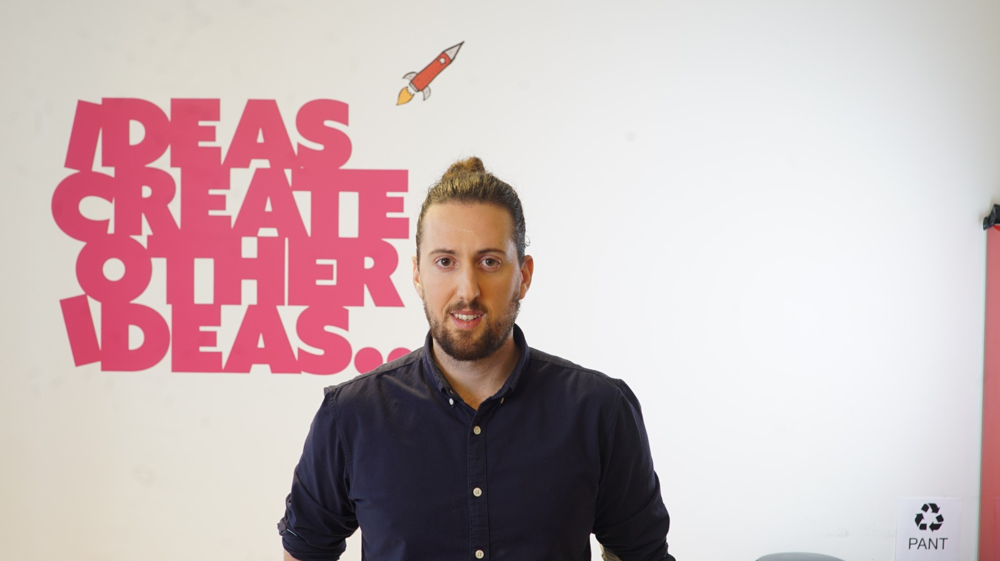

  
  <figcaption> 
    <h4>This is me!</h4>  
  </figcaption>

# Hi there!

I'm Javier. Originally from Madrid, Spain :es:. I now live in Stockholm, Sweden :sweden:. I moved to Sweden in August, 2016 to pursue the Masters in Medical Engineering   and Machine Learning at [KTH (The Royal Institute of Technology)](https://www.kth.se)  in Stockholm. My background is in Telecommunications Engineering (B.Eng) at [Universidad Rey Juan Carlos (URJC)](https://www.urjc.es) in Madrid (Spain). There I developed most of my technical skills in maths, statistics and programming. I completed my bachelor's studies at [NTNU](https://www.ntnu.edu) in Trondheim (Norway :norway:). Thereafter, I lived in Coventry (UK :uk:) doing an internship as a Software Engineer at [Exergy LTD](https://www.linkedin.com/company/exergy/about/). Furthermore, I had another exchange semester in Msc. Artificial Intelligence at [KU Leuven](https://www.kuleuven.be/english/) (Belgium :belgium:). 

Currently, I'm a data scientist consultant at [Webstep](https://www.webstep.se). Previously I worked as a Senior data analyst at [Utopia Music](https://utopiamusic.com), data scientist consultant at [Digital Workforce](https://digitalworkforce.com), product data scientist at [BYON8](https://www.byon8.com), Cybersecurity consultant in [PWC](https://www.pwc.com), having assignments at the leading insurance company in Spain [MAPFRE](https://www.mapfre.com). Furthermore, I was working as a research assistant at [Universidad Rey Juan Carlos (URJC)](https://www.urjc.es) and an IT consultant engineer in [Management Solutions](https://www.managementsolutions.com/en), having assignments at [BBVA](https://www.bbva.es/en/personas.html), one of the leading banks in Spain :es: 

## Thanks for Visiting!

